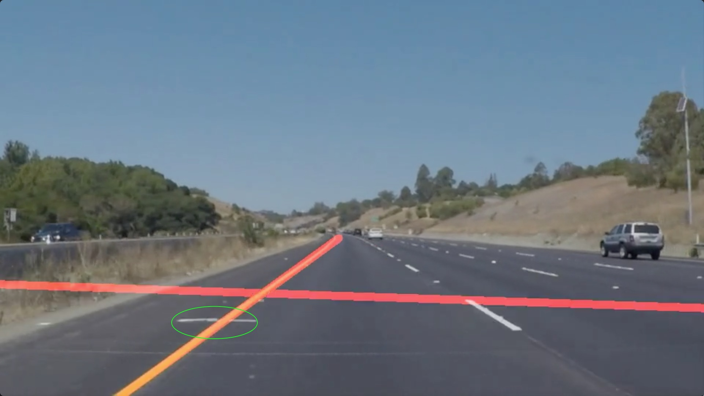

# **Finding Lane Lines on the Road**

## Writeup Template

### You can use this file as a template for your writeup if you want to submit it as a markdown file. But feel free to use some other method and submit a pdf if you prefer.

---

**Finding Lane Lines on the Road**

The goals / steps of this project are the following:
* Make a pipeline that finds lane lines on the road
* Reflect on your work in a written report

[//]: # (Image References)

[image1]: ./examples/grayscale.jpg "Grayscale"

---

### Reflection

### 1. Describe your pipeline.

My pipeline consisted of multiple steps.

1. First, I converted the images to grayscale  
2. Defined a kernel size = 5 and applied Gaussian smoothing
3. Applied Canny Edge Detection algorithm on the smoothed grayscale image to extract edges, with low and high threshold values equal to 50 and 150 respectively.
4. Then I created a region that has high possibility of containing the lines of interest. The region of interest(ROI) polygon dimensions are tuned to cover the two lanes from all test images.
5. After extracting the ROI image, it was applied on the canny edges image to blackout all the pixels that fall out of the ROI polygon.
6. The new image with just the edges within the ROI polygon is processed to extract line segments, using the probabilistic Hough transform.
7. The Hough lines are post processed using draw_lines() method. this is explained in the next section

### 2. Explain how you modified the draw_lines() function.
In order to draw a single line on the left and right lanes, I modified the draw_lines() function by:

1. I started of by parsing thru the lines to compute the slope ((y2-y1)/(x2-x1)).
2. Once the slope is computed for each line, the slope is checked if its not infinity or zero, since it can cause divide by zero error, when solving the line. So the line is further processed only if the slope is valid and if not its discarded.
3. Since the origin(0,0) of the image start at top left, the lines on the left lane have a negative slope, and vice versa for the lines on the right lane. Thus the lines are separated into two lists of left and right lane lines.
4. Also, during the separation of lines based on the of the slope, the minimum y coordinate(min_y) among all the lines is computed, for both lines. Here we are computing the minimum as we are working with origin at top left.
5. Once the lines are separated the group of lines on each side are used to fit a line based on a condition that there is at least one line in the group of lines. The line fitting functionality is implemented in fit_line() method, which uses simple linear regression.
The line for a simple linear regression model can be written as:
        y = mx + b
        where m is the slope of the line and b is the y-intercept.
The y-intercept of this line is the value of y at the point where the line crosses the y axis. The fit_line() method solves for m and b. Once these are known, we can use this equation to estimate output values for x given new input examples of y. the two values of y for which corresponding x values is computed are the y_bottom = edge of image boundary(image height) and y_top = min_y. This is done on both left and right lane lines to get a single line coordinates(x_bottom, y_bottom, x_top and y_top).
6. The drawback with above process was that there were some unwanted lines that are being detected by hough transform. In the images 1 and 2 below, the line circled in green is being detected, and based on its positive slope its being grouped into right lane lines. The line fit for the points is being pulled to the left to compensate. this has been noted in couple other frames in solidYellowLeft and challenge videos

    

    

7. To eliminate such unwanted lines creeping into final group of lines, I have created a simple list of slope ranges. So during the parsing of the lines, the lines that are separated for further processing are checked to see if their slope is within the range for left and right lanes respectively.

        Left slope range    : min =  -1 and max = -0.4,
        Right Slope range   : min = 0.4 and max =    1

8. The use of the slope range filtered out the line that were being detected across the road(parallel to the base of the image). For the same frame as Image 2 above, the good result is shown below.

    

### 3. Potential shortcomings with current pipeline

##### Position of Camera

The current ROI polygon dimensions and position have been based on the current set of provided data. It assumes that the position of camera remains the same for any dataset and that the lanes have slopes that fall into the slope range(which is again tuned based on the provided dataset)

##### Curved lanes

The current linear regression fits a straight line through given points. But this does not work good in case where the driver is passing through a turn, as it leads to converging lane lines as shown in image below.

##### Road Condition
The implementation cannot filter out unwanted lines that fall within the slope range, since the slope range is currently hardcoded and thus remains the same for every dataset to be tested. In the image below there is a line detected due to change in color of the road. Its the beginning of the bridge in this case. This line falls within the ROI and is thus appended to the left lane lines list. Again the line fit is distorted to compensate for points of this line across the road.

### 4. Suggest possible improvements to your pipeline

##### Dynamic Region of interest

The current ROI polygon is based proportional to the image/frame width and height. But to make it dynamic or adaptive, one can extract some helpful features and compute the ROI on the fly which will be a better way to mask out the unwanted lines.

##### Higher order curve fitting methods

The equation

    y = mx + b
is a first degree polynomial equation. We can increase the order of the equation is increased to a second degree polynomial eq.

    y = a(x)^2 + bx + c
One can test 2nd , 3rd or beyond polynomial regression to see how the lanes detected look. Since this project required straight line , I have limited the results to use 1st degree equation only.

##### Invariant to Road Conditions
The filtering of lines in draw_lines() method need to be updated to filter unwanted line that crop up due to change in road condition. The ROI polygon might have to be modified to not cover the middle section of region between the lanes.

Another potential improvement could be to ...
